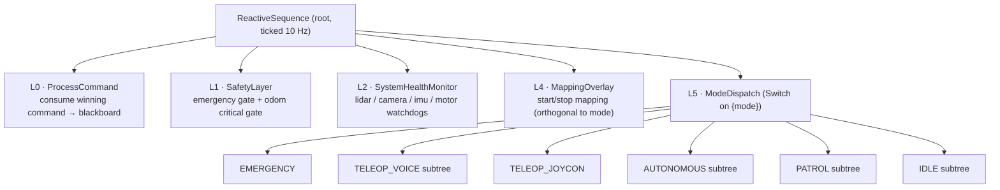
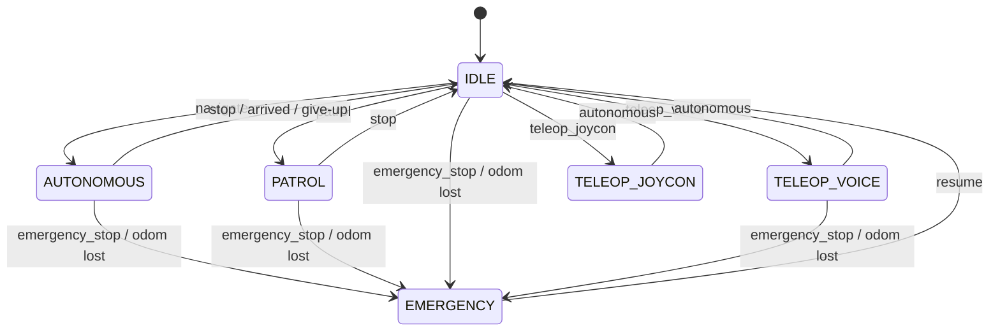

# rover_bt

The central **behavior tree (BT)** brain for the autonomous rover. A single C++
node (`rover_bt_node`) ticks a [BehaviorTree.CPP v4](https://www.behaviortree.dev/)
tree that owns the rover's high-level behaviour: mode management, navigation
supervision, sensor-health watchdogs / emergency-stop, multi-input command
arbitration (voice / joycon / GUI / service), mapping lifecycle, and spoken
(TTS) feedback. A companion Python node (`voice_command_node.py`) does Spanish
speech recognition and feeds commands in.

```
voice / joycon / GUI / service  ──►  Command arbitrator  ──►  Behavior Tree  ──►  /cmd_vel_safe
                                          (priority queue)        (10 Hz)            + TTS + /rover_bt/status
```

---

## Table of contents

- [Part 1 — Operator guide](#part-1--operator-guide)
  - [Build & install](#build--install)
  - [Launch](#launch)
  - [Commanding the rover](#commanding-the-rover)
  - [Voice commands](#voice-commands)
  - [Reading status](#reading-status)
- [Part 2 — How it works](#part-2--how-it-works)
  - [The node](#the-node)
  - [The behavior tree](#the-behavior-tree-4-layers)
  - [Mode state machine](#mode-state-machine)
  - [Command arbitration](#command-arbitration)
  - [Navigation supervision & recovery](#navigation-supervision--recovery)
  - [Sensor health & emergency stop](#sensor-health--emergency-stop)
  - [The blackboard contract](#the-blackboard-contract)
  - [Custom BT node catalog](#custom-bt-node-catalog)
- [Part 3 — Reference](#part-3--reference)
  - [Commands](#commands)
  - [Services](#services)
  - [Topics](#topics)
  - [Parameters](#parameters)
- [Part 4 — Debugging](#part-4--debugging)
- [Extending the tree](#extending-the-tree)

---

# Part 1 — Operator guide

## Build & install

The node itself builds with plain `colcon`. The **voice** stack pulls in models
and Python deps, so on a fresh clone run the installer first (one time):

```bash
# from the workspace src/ directory
bash rover_bt/scripts/install_voice_assets.sh
```

This downloads (into `rover_bt/voice_assets/`, which is git-ignored):
- the **faster-whisper** ASR model cache (`tiny` + `base`),
- the **Piper** TTS binary + shared libs,
- the Piper Spanish voice model (`es_MX-claude-high`),

and `pip install`s `faster-whisper`, `webrtcvad`, `sounddevice`.

Then build:

```bash
colcon build --packages-select rover_bt --symlink-install
source install/setup.bash
```

> The Bash/zsh note: if your shell can't `source` the ROS setup, wrap ROS
> commands in `bash -c '...'`.

## Launch

**Real hardware:**

```bash
ros2 launch rover_bt rover_bt.launch.py
```

**Simulation** (Gazebo) — uses sim time and sim sensor topics:

```bash
ros2 launch rover_bt rover_bt_sim.launch.py
```

Common launch args (both files): `params_file`, `tree_xml`, `log_level`
(`debug|info|warn|error`). The sim launch adds `use_sim_time` (default `true`)
and `dynamic_waypoints_file` (defaults to the sim waypoints matched to the sim
map).

> ⚠️ **In simulation `use_sim_time` must be true.** Sensor stamps are sim-time
> (a few seconds); without sim time the node compares them against wall-clock
> `now()` (~1.7 × 10⁹ s), every watchdog sees enormous staleness, and the odom
> critical gate latches `EMERGENCY` forever. The sim launch sets this for you.

## Commanding the rover

Anything that drives the rover goes through one entry point — the
**`/rover_bt/send_command`** service — or arrives organically from the voice or
joycon nodes. The simplest way to drive it by hand:

```bash
# Navigate to a saved/known location
ros2 service call /rover_bt/send_command rover_bt/srv/SendCommand \
  "{source: 'gui', command: 'navigate', target: 'cocina'}"

# Stop / cancel whatever it is doing
ros2 service call /rover_bt/send_command rover_bt/srv/SendCommand \
  "{source: 'gui', command: 'stop', target: ''}"

# Emergency stop (highest priority, pre-empts everything)
ros2 service call /rover_bt/send_command rover_bt/srv/SendCommand \
  "{source: 'gui', command: 'emergency_stop', target: ''}"

# Resume from emergency
ros2 service call /rover_bt/send_command rover_bt/srv/SendCommand \
  "{source: 'gui', command: 'resume', target: ''}"
```

`source` sets the priority when commands collide (see
[Command arbitration](#command-arbitration)). Use `gui` for manual testing.

Save the rover's **current pose** as a named location:

```bash
ros2 service call /rover_bt/save_location rover_bt/srv/SaveLocation \
  "{name: 'mesa', lanelet: ''}"
```

## Voice commands

The voice node listens for the **wake word** (`comando` by default), beeps, then
listens for one command. Say `emergencia` at any time to e-stop — it bypasses the
wake word. To navigate, say `ve a <place>` / `ir a <place>`.

| Say (Spanish) | Command | Effect |
|---|---|---|
| `emergencia` | `emergency_stop` | Immediate stop, mode → EMERGENCY (no wake word needed) |
| `reanuda` | `resume` | Leave EMERGENCY, back to IDLE |
| `avanza` / `adelante` | `forward` | Drive forward briefly (teleop voice) |
| `retrocede` / `atrás` | `backward` | Drive backward briefly |
| `izquierda` / `gira a la izquierda` | `turn_left` | Turn left |
| `derecha` / `gira a la derecha` | `turn_right` | Turn right |
| `detente` / `alto` / `para` | `stop` | Stop / cancel |
| `ve a <lugar>` / `ir a <lugar>` | `navigate` | Navigate to a known location |
| `patrulla` | `patrol` | Start patrol over `patrol_waypoints` |
| `modo voz` / `teleop voz` | `teleop_voice` | Enter voice-teleop mode |
| `modo joycon` | `teleop_joycon` | Enter joycon mode |
| `modo autónomo` / `autónomo` | `autonomous` | Leave teleop → IDLE (ready for nav) |
| `inicia mapeo` | `start_mapping` | Start new map (RTAB-Map mapping) |
| `detén el mapeo` / `guarda el mapa` | `stop_mapping` | Stop & save the map |
| `estado` / `dónde estás` | `status` | Publish/announce status |
| `seguir persona` / `sígueme` | `person_track` | Person-follow mode *(not yet implemented)* |

The exact phrase map (including phonetic near-misses the recognizer produces)
lives in [`scripts/voice_command_node.py`](scripts/voice_command_node.py)
(`COMMAND_MAP`). Add aliases there.

## Reading status

The node publishes `rover_bt/msg/RoverStatus` on **`/rover_bt/status`** at ~1 Hz —
this is your primary observability surface:

```bash
ros2 topic echo /rover_bt/status
```

Fields: `mode`, `active_command_source`, `navigation_status`, `goal_distance`
(metres, `-1` when no goal), `target_location`, `sensor_health[]` (per-sensor
OK/STALE + seconds since last message), `is_mapping`, `mapping_mode`.

---

# Part 2 — How it works

## The node

`rover_bt_node` ([src/rover_bt_node.cpp](src/rover_bt_node.cpp)) wires everything
together:

- **Subscriptions** keep timestamps + pose in a `SharedContext`: `/odom`,
  `/amcl_robot_pose` (map-frame pose, takes over from odom when present),
  `/scan` (lidar), pointcloud (`/k4a/points2` real, `/depth_camera/points` sim),
  `/imu/data`, `/sdv_trajectory` (planner heartbeat), `/rover_bt/commands`,
  `/joy`.
- **Publishers**: `/cmd_vel_safe` (velocity), `/rover_bt/status` (1 Hz).
- **Services**: `/rover_bt/send_command`, `/rover_bt/save_location`.
- **Two timers**: the BT **tick** (10 Hz, configurable via `bt_tick_rate`) and
  the **status publisher** (1 Hz).

The tree XML is loaded at startup from `tree_xml` (defaults to the installed
[`trees/rover_bt_main.xml`](trees/rover_bt_main.xml)). All custom nodes are
registered with the BT factory in `init_behavior_tree()`.

## The behavior tree (4 layers)

The root is a **`ReactiveSequence`** — it re-ticks *every* child from the top on
each cycle, even while a later layer holds a long-running action (navigation /
teleop move). This is essential: it keeps Safety and command arbitration live
during navigation. Each layer returns `SUCCESS` in normal operation, so the
sequence always reaches the mode dispatch at the bottom.



Why this order matters:

- **L0 `ProcessCommand` runs *before* Safety** so an `emergency_stop` command is
  visible to the emergency gate on the *same* tick. If it ran after, the mode
  dispatch's `ClearCommand` would wipe the command before Safety saw it.
- **Safety is highest priority** and always ticks. The odom gate triggers an
  e-stop independent of the current command.
- **Mapping is an overlay** — `is_mapping` is orthogonal to the drive mode, so
  you can map while idle/teleop without changing mode.
- **Mode dispatch** is a `Switch` on the `{mode}` blackboard variable; each mode
  is a small `Fallback`/subtree.

The long-running navigation lives **inside** the `AUTONOMOUS`/`PATROL` subtrees
as the *default* `RUNNING` leaf of a `ReactiveFallback`, with guard branches
(stop / succeeded / failed / stalled / planner-timeout) re-checked every tick.
This is what lets a `stop` cancel a drive mid-motion and lets the supervisor
react to goal completion or failure.

## Mode state machine

`{mode}` is the master state. Commands cause transitions (handled per-mode in
the subtrees):



`EMERGENCY` is sticky: while in it, every command except `resume` is discarded,
so a `navigate` arriving during an emergency does nothing. `PERSON_TRACK` is
referenced by commands but has no implemented case yet — the dispatch's default
resets it to `IDLE`.

## Command arbitration

All inputs converge on a single priority queue
([`CommandArbitrator`](src/command_arbitrator.cpp)). When multiple commands are
pending, the **lowest priority number wins**:

| Priority | Source | Set when |
|---|---|---|
| **0** | emergency | `command == "emergency_stop"` (any source) |
| 1 | joycon | `source == "joycon"` |
| 2 | voice | `source == "voice"` |
| 3 | gui | `source == "gui"` |
| 4 | ros_service / other | anything else |

`ProcessCommand` (L0) consumes exactly **one** command per tick, copies it onto
the blackboard (`command`, `active_command_source`, `target_location`), and for a
fresh `navigate`/`patrol` resets `nav_status` and `recovery_attempted`. The
consuming subtree then calls `ClearCommand` once it has acted on it.

## Navigation supervision & recovery

`NavigateToGoal` ([src/nodes/actions/navigate_to_goal.cpp](src/nodes/actions/navigate_to_goal.cpp))
is a `StatefulActionNode` that wraps a `navigate_to_goal` **action client** (the
planner stack is the server). It looks the target name up in the
[`LocationRegistry`](src/location_registry.cpp), sends a goal pose, and drives
`{nav_status}` through these states:

```
idle → navigating → succeeded         (goal reached)
                  → failed            (rejected / aborted / unknown location)
                  → planner_timeout   (no action server)
                  → stalled           (no progress — set by supervisor)
```

The `AUTONOMOUS`/`PATROL` supervisor reads `{nav_status}` each tick and branches:
`succeeded` → announce + IDLE (PATROL advances to the next waypoint instead),
`failed`/`stalled` → **tiered recovery**, `planner_timeout` → give up + IDLE.

**Tiered recovery** (`RecoverySubtree`): attempt 1 requests a replan
(`RequestReplan`, sets `recovery_attempted`); if it fails again, attempt 2 gives
up — zeroes velocity, says "No puedo llegar al destino", returns to IDLE. The
`recovery_attempted` flag is reset once per fresh command (in `ProcessCommand`),
**not** in `NavigateToGoal::onStart` — otherwise the running leaf would reset it
every tick and loop recovery forever.

## Sensor health & emergency stop

Two tiers of watchdog, both comparing the last message stamp against `now()`:

- **Critical — odom** (`odom_stale_timeout`, default 3 s): handled in the
  Safety layer. If odom goes stale → `ZeroTwist`, mode `EMERGENCY`, TTS
  "Odometría perdida". Restoring odom + a `resume` returns to IDLE.
- **Warn — lidar / camera / imu / motor** (`*_stale_timeout`, default 5 s):
  reported in `sensor_health[]` but do **not** stop the rover.

A sensor that has *never* produced data reports `STALE` with `last_seen_ago = -1`
("no data yet") — expected during startup grace, and for `motor` in sim (no
motor topic).

## The blackboard contract

The tree communicates through these root-blackboard keys (initialized in
`init_behavior_tree()`):

| Key | Type | Meaning |
|---|---|---|
| `context` | `SharedContext` | shared C++ state (sensor times, pose, subsystems) |
| `mode` | string | current mode (drives `ModeDispatch`) |
| `command` | string | command currently being processed |
| `active_command_source` | string | who issued the active command |
| `target_location` | string | nav target name (durable — survives `ClearCommand`) |
| `nav_status` | string | `idle`/`navigating`/`succeeded`/`failed`/`stalled`/`planner_timeout` |
| `is_mapping` / `mapping_mode` | bool / string | mapping overlay state |
| `patrol_index` / `patrol_waypoint` | int / string | patrol cursor |
| `recovery_attempted` | bool | tiered-recovery latch |
| `goal_distance` | double | metres remaining (from action feedback) |

> **Subtree gotcha:** BehaviorTree.CPP v4 gives a bare `<SubTree>` its **own**
> blackboard. Every `<SubTree>` invocation here uses `_autoremap="true"` so
> child reads/writes of `{mode}`, `{command}`, `{context}` reach the root
> blackboard. Forgetting this silently disconnects a subtree's state.

## Custom BT node catalog

Registered in [src/rover_bt_node.cpp](src/rover_bt_node.cpp); sources under
[src/nodes/](src/nodes/).

**Conditions** (`include/rover_bt/nodes/conditions/`):

| Node | Purpose |
|---|---|
| `CheckMode` | true if `{mode}` equals `expected` |
| `CheckCommand` | true if `{command}` equals `expected` |
| `CheckSensorHealth` | true if a sensor is fresh; `on_fail=warn\|error`, `max_stale_sec` |
| `CheckNavStatus` | true if `{nav_status}` equals `expected` |
| `CheckFlag` | true if a bool blackboard flag is set (supports `negate`) |

**Actions** (`include/rover_bt/nodes/actions/`):

| Node | Purpose |
|---|---|
| `ProcessCommand` | consume one arbitrated command → blackboard |
| `NavigateToGoal` | action-client drive to a named location (RUNNING leaf) |
| `MoveRover` | timed open-loop velocity (teleop), `linear`/`angular`/`duration` |
| `ZeroTwist` | publish zero velocity (stop) |
| `SetMode` | set `{mode}` |
| `SetFlag` | set a bool flag |
| `ClearCommand` | clear `{command}` (keeps `target_location`) |
| `Speak` | TTS (Piper); supports `{blackboard}` interpolation |
| `StartMapping` / `StopMapping` | mapping overlay (`mapping`/`slam`) |
| `RequestReplan` | ask planner to replan (recovery attempt 1) |
| `IncrementPatrolIndex` | advance patrol cursor + reset nav_status |
| `SaveLocation` | persist current pose as a named waypoint |
| `PublishStatus` | log/announce status on demand |

---

# Part 3 — Reference

## Commands

`command` strings understood by the tree (via service, voice, or joycon):

`emergency_stop`, `resume`, `navigate` (+`target`), `patrol`, `stop`,
`forward`, `backward`, `turn_left`, `turn_right`, `teleop_voice`,
`teleop_joycon`, `autonomous`, `person_track`, `start_mapping`, `start_slam`,
`stop_mapping`, `save_location` (+`target`), `status`.

Unknown commands are safely discarded (the node stays alive).

## Services

| Service | Type | Purpose |
|---|---|---|
| `/rover_bt/send_command` | `rover_bt/srv/SendCommand` | inject a command (`source`, `command`, `target`) |
| `/rover_bt/save_location` | `rover_bt/srv/SaveLocation` | save current pose as `name` (+optional `lanelet`) |

## Topics

| Topic | Dir | Type | Notes |
|---|---|---|---|
| `/rover_bt/status` | pub | `rover_bt/msg/RoverStatus` | 1 Hz state + sensor health |
| `/cmd_vel_safe` | pub | `geometry_msgs/Twist` | velocity output |
| `/rover_bt/commands` | sub | `rover_bt/msg/Command` | typed commands (e.g. from voice node) |
| `/odom` | sub | `nav_msgs/Odometry` | **critical** for e-stop |
| `/amcl_robot_pose` | sub | `geometry_msgs/PoseWithCovarianceStamped` | map-frame pose (overrides odom) |
| `/scan` | sub | `sensor_msgs/LaserScan` | lidar health |
| pointcloud | sub | `sensor_msgs/PointCloud2` | camera health (`/k4a/points2` ‖ `/depth_camera/points`) |
| `/imu/data` | sub | `sensor_msgs/Imu` | imu health |
| `/sdv_trajectory` | sub | `nav_msgs/Path` | planner heartbeat |
| `/joy` | sub | `sensor_msgs/Joy` | joycon teleop (deadman = L1/R1) |
| `navigate_to_goal` | action client | `rover_bt/action/NavigateToGoal` | planner is the server |

## Parameters

Full list with defaults in
[`config/rover_bt_params.yaml`](config/rover_bt_params.yaml). Highlights:

- **BT**: `bt_tick_rate` (10 Hz), `tree_xml` (empty → installed default).
- **Topics**: all subscription/publication topics are remappable params.
- **Nav supervision**: `goal_timeout`, `planner_heartbeat_timeout`,
  `nmpc_stall_velocity`/`nmpc_stall_timeout`, `goal_tolerance`.
- **Sensor health**: `odom_stale_timeout` (3 s, critical), others 5 s.
- **TTS**: `tts_enabled`, `piper_bin`, `piper_model` (empty → auto-detect from
  install).
- **Locations**: `dynamic_waypoints_file` (named waypoints), `lanelet2_map`.
- **Patrol**: `patrol_waypoints` — ordered list of location names.

> ⚠️ **Never set `patrol_waypoints: []`.** An empty YAML list loads as
> `PARAMETER_NOT_SET` and aborts the node at startup (SIGABRT). Leave the line
> commented out for "no patrol" — the node defaults to empty. To enable patrol,
> give it real names, e.g. `patrol_waypoints: ["cocina", "sala"]`.

---

# Part 4 — Debugging

**First stop: watch the status topic.** It tells you mode, nav status, command
source, goal distance, and per-sensor freshness in one place.

```bash
ros2 topic echo /rover_bt/status
ros2 node info /rover_bt_node        # confirm all subs/pubs exist
ros2 topic hz /rover_bt/status       # should read ~1.0 Hz; if not, the tree is wedged
```

Common situations and what they mean:

| Symptom | Likely cause | Check / fix |
|---|---|---|
| Stuck in `EMERGENCY` immediately on boot, "Odometría perdida" spam | **Sim time not set** — sensor stamps (sim) vs wall-clock `now()` | Launch with `use_sim_time:=true` (sim launch does this). Confirm `/clock` is publishing and `use_sim_time` param is `true`. |
| `EMERGENCY`, odom shows `stale by …` | odom genuinely stale / EKF dead | Check `/odom` is publishing fresh stamps; restart the localization/EKF node, then send `resume`. |
| `/rover_bt/status` not publishing / not ~1 Hz | tree not ticking or node crashed | Check node is alive and `bt_tick_rate`; look for exceptions in node stdout. |
| `navigate <x>` → "No conozco la ubicación x" | location not in registry | Confirm `x` exists in your waypoints file / lanelet map; in sim, `dynamic_waypoints_file` must point at the sim waypoints whose coords/lanelets match the map. |
| `navigate` accepted but rover never moves, `goal_distance` static | planner/NMPC not producing a trajectory | Check the planner stack: is the `navigate_to_goal` action server up? Is `/sdv_trajectory` publishing? Do lanelet start/end names match the loaded map? rover_bt's job (send goal, track feedback) is done — the issue is downstream. |
| "Planificador no responde" | no `navigate_to_goal` action server | Bring up the planner before commanding nav. |
| Endless "Replanificando ruta", never gives up | `recovery_attempted` being reset every tick | Should be fixed (reset only per-command in `ProcessCommand`); if you edited recovery, don't reset the flag in `NavigateToGoal::onStart`. |
| A subtree's mode switch silently no-ops | missing `_autoremap="true"` on the `<SubTree>` | Add it — see [the blackboard contract](#the-blackboard-contract). |
| No speech / no audio | TTS disabled or Piper not installed | `tts_enabled` + `piper_bin`/`piper_model`; in sim TTS is typically mock — watch the `[Speak]`/`[TTS]` log lines instead of expecting audio. |
| Voice node injects spurious `stop`/`backward` | mic noise / false ASR triggers | Tune VAD aggressiveness / wake handling in `voice_command_node.py`, or run without it and drive via the service for deterministic testing. |

**Inject commands deterministically** (bypass voice) with
`ros2 service call /rover_bt/send_command …` (see
[Commanding the rover](#commanding-the-rover)).

**Turn up logging:**

```bash
ros2 launch rover_bt rover_bt.launch.py log_level:=debug
```

`ProcessCommand`, `NavigateToGoal`, and the watchdogs all log at info/debug, so
`debug` shows every consumed command, goal acceptance, and feedback distance.

---

# Extending the tree

1. **Add a node**: create the header in
   `include/rover_bt/nodes/{actions,conditions}/`, the source in
   `src/nodes/...`, add it to the corresponding list in
   [CMakeLists.txt](CMakeLists.txt), and **register it** in
   `init_behavior_tree()` ([src/rover_bt_node.cpp](src/rover_bt_node.cpp)) with
   `factory_.registerNodeType<YourNode>("YourNode")`.
2. **Use it** in [trees/rover_bt_main.xml](trees/rover_bt_main.xml). With
   `--symlink-install` you can edit the XML and just relaunch (no rebuild) since
   the installed file is a symlink.
3. **Respect the contract**: read/write shared state through the documented
   blackboard keys; keep a long-running action as the default `RUNNING` leaf of a
   `ReactiveFallback` with reactive guards above it; put any new `<SubTree>` with
   `_autoremap="true"`.
4. **Add a new mode**: add a case to the `Switch` in the XML, add the command +
   `SetMode` transition in the relevant subtree(s), and extend the voice
   `COMMAND_MAP` if it should be voice-reachable.
```
